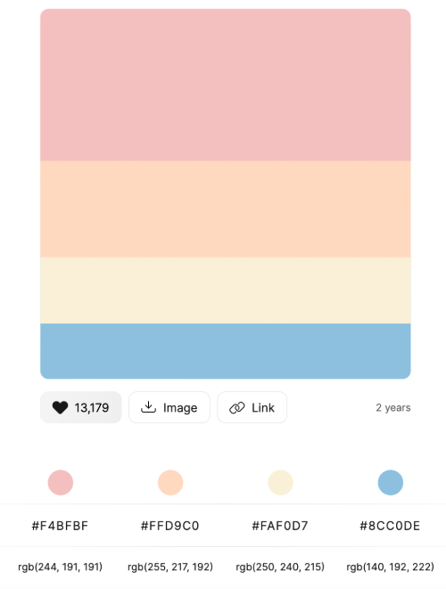
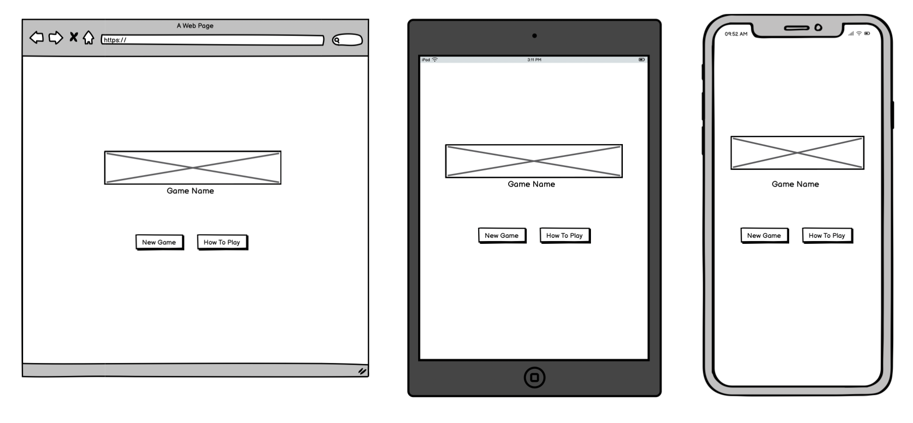
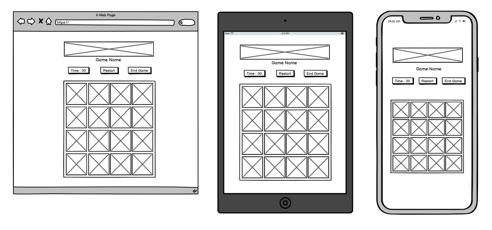
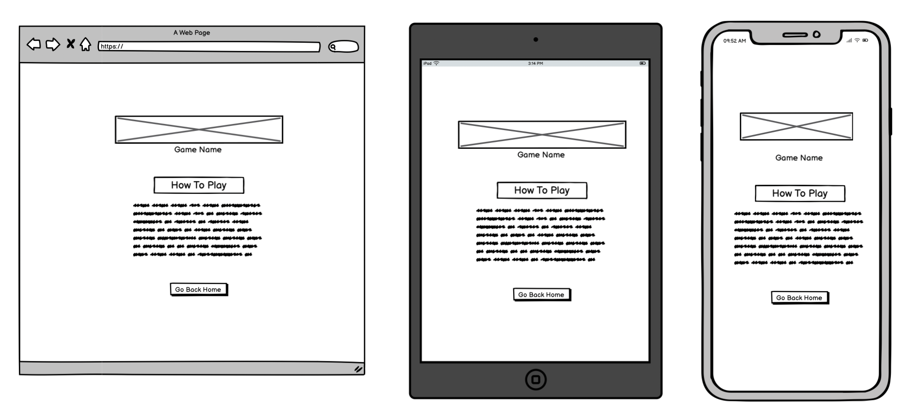

# Fetch & Match

Fetch & Match is an interactive memory game which allows users to match cards.

To see the live version of the site click [here](https://nweying.github.io/fetch-and-match/)!

## CONTENTS

* [User Experience (UX)](#User-Experience-UX)
  * [User Stories](#User-Stories)

* [Design](#Design)
  * [Colour Scheme](#Colour-Scheme)
  * [Typography](#Typography)
  * [Imagery](#Imagery)
  * [Wireframes](#Wireframes)

* [Features](#Features)
    * [Accessibility](#Accessibility)

* [Technologies Used](#Technologies-Used)
  * [Languages Used](#Languages-Used)
  * [Frameworks, Libraries & Programs Used](#Frameworks-Libraries--Programs-Used)

* [Deployment & Local Development](#Deployment--Local-Development)
  * [Deployment](#Deployment)
  * [Local Development](#Local-Development)
    * [How to Fork](#How-to-Fork)
    * [How to Clone](#How-to-Clone)

* [Testing](#Testing)
  * [Testing User Stories](#Testing-User-Stories-from-User-Experience-UX-Section)
  * [HTML Validation](#HTML-Validation)
  * [CSS Validation](#CSS-Validation)
  * [JS Validation](#JS-Validation)
  * [Lighthouse](#Lighthouse)
  * [Browser Compatability & Responsiveness](#Browser-Compatability--Responsiveness)
  * [Bugs](#Bugs--Fixes)

* [Credits](#Credits)
  * [Code Used](#Code-Used)
  * [Content](#Content)
  * [Media](#Media)
  * [Acknowledgments](#Acknowledgments)

- - -

## User Experience (UX)

### Target Audience

Fetch & Match is designed to appeal to a broad audience, including:
* Children and Families: The cute dog graphics and simple gameplay make it a fun game for children, while also being an enjoyable activity for family bonding.
* Casual Gamers: Those looking for a quick and entertaining game to pass the time will find Fetch & Match engaging and easy to pick up.
* Dog Lovers: With its dog-themed cards, the game is a perfect match for dog enthusiasts of all ages.
* Memory Game Enthusiasts: Fans of memory and matching games will appreciate the challenge and satisfaction of completing the game.
* Individuals Seeking Cognitive Exercise: The game provides a fun way to improve memory and cognitive skills, appealing to those interested in brain training activities.

### User Stories

#### As a New User:
* I want to easily understand how to play the game so that I can start enjoying the game without confusion.
* When I visit the home page, I see a 'How to Play' button that provides a clear and concise guide on playing the memory game.

#### As a Returning User:
* I want to quickly start a new game so that I can immediately begin matching dog cards.
* When I visit the home page, I can click the 'New Game' button to start a new game instantly.

#### As a Competitive Player:
* I want to see a timer that tracks my game completion time so that I can challenge myself to improve my speed.
* During the game, I see a timer at the top of the page that starts counting as soon as the game begins and stops when all pairs are matched.

#### As a User Who Made a Mistake:
* I want to restart the game without going back to the home page so that I can quickly correct my mistakes and try again.
*  On the game page, I can click the 'Restart' button to reset the game and timer instantly.

- - -

## Design

### Colour Scheme

To reflect the playful theme of Fetch & Match and its adorable dog characters, I designed the website using a cheerful and vibrant color palette. The colour palette was created using the [Color Hunt](https://colorhunt.co/) website.

### Typography

'Lobster' from Google Fonts is used for the headings and 'GoodDog' from CDN fonts was used for the body text. These fonts were chosen to evoke a playful, game-like atmosphere.

### Wireframes

Wireframes were developed for mobile, tablet, and desktop devices, ensuring good user experience across various screen sizes.

**Home Page:**

**Game Page:**

**How to Play Page:**

- - -

## Features

The website consists of three pages: the home page, the game page and the how-to-play page. 

* **Home Page**

  * The home page features the game title prominently, accompanied by two primary buttons: 'New Game' and 'How to Play'. Clicking 'New Game' takes users directly to the memory game, while 'How to Play' provides a helpful guide. To enhance user interaction, hovering over each button highlights the links.

* **Game Page**
  * At the top of the game page, a timer displays how long it takes the user to complete the game. Beside the timer are two buttons: 'Restart' and 'End Game.' Clicking 'Restart' resets the timer, while 'End Game' returns the user to the home page. Below these controls, users can engage in the memory game by clicking on hidden cards to reveal images. Matching pairs will remain flipped until the game is completed.
  
  * When the user successfully pairs all the cards, a pop-up message will appear, along with the time it took to complete the game. An 'OK' button allows the user to close the pop-up and return to the home page.

* **How to Play Page**
  * On the How to Play page, the user will find an explanation on how the memory game works. A button is provided to navigate back to the home page.

### Accessibility

The website adheres to accessibility guidelines, ensuring it is responsive and inclusive for all users.

- - -

## Technologies Used

### Languages Used

- HTML
- CSS
- JavaScript

### Frameworks, Libraries & Programs Used

- Bootstrap Version 5.3.3 - The framework provided code assist with the responsiveness and styling of the website.

- Balsamiq - To create wireframes for all pages.

- CDN Fonts - To import the fonts used on the website.

- Git - For version control.

- Gitpod - To write code for the website.

- Github - To save and store the files for the website.

- Google Fonts - To import the fonts used on the website.

- Google Dev Tools - To test and troubleshoot features, and assist with responsiveness and styling.

- [Adobe Express](https://www.adobe.com/express/) To resize images.

- [Am I Responsive?](http://ami.responsivedesign.is/) To show the website images on a range of devices.

- [Freepik](https://www.freepik.com/) and [Vectezzy](https://www.vecteezy.com/) For all images used in website.

- - -

## Deployment & Local Development

### Deployment

Github Pages was used to deploy the live website. The instructions to achieve this are below:

1. Log in (or sign up) to Github.
2. Find the repository for this project, [Fetch & Match Github](https://github.com/nweying/fetch-and-match).
3. Click on the Settings link.
4. Click on the Pages link in the left hand side navigation bar.
5. In the Source section, choose main from the drop down select branch menu. Select Root from the drop down select folder menu.
6. Click Save. Your live Github Pages site is now deployed at the URL shown.

### Local Development

#### How to Fork

To fork the Posh Pawpy repository:

1. Log in (or sign up) to Github.
2. Go to the repository for this project, [Fetch & Match Github](https://github.com/nweying/fetch-and-match).
3. Click the Fork button in the top right corner.

#### How to Clone

To clone the Posh Pawpy repository:

1. Log in (or sign up) to GitHub.
2. Go to the repository for this project, [Fetch & Match Github](https://github.com/nweying/fetch-and-match).
3. Click on the code button, select whether you would like to clone with HTTPS, SSH or GitHub CLI and copy the link shown.
4. Open the terminal in your code editor and change the current working directory to the location you want to use for the cloned directory.
5. Type 'git clone' into the terminal and then paste the link you copied in step 3.
6. Press Enter. Your local clone will be created.

- - -

## Testing

### Testing User Stories from User Experience (UX) Section

All user stories have been thoroughly tested and validated for functionality and user experience.

-   #### New User Goals

    * I want to easily understand how to play the game so that I can start enjoying the game without confusion.

        Upon entering the site, users can immediately see a hero section featuring a welcoming message and a hero image, offering an initial glimpse into the business. Directly below, users encounter a distinctive logo presentation and an "About Us" section, facilitating a deeper understanding of the business's nature and ethos.

        
    
-   #### Returning User Goals

    * As a first time visitor, I want to easily navigate through the website to find essential information such as contact details and location.

        1. The navigation bar fixed at the top of each page allows first-time visitors to easily explore different sections of the website. Contact details and operating hours are conveniently located in the footer section on every page for quick access.

        

        

-   #### Competitive Player Goals

    3. As a first time visitor, I want to learn about the services offered by Posh Pawpy.

        1. Upon selecting the "Services" page from the navigation bar, users are directed to a page displaying the services available, along with a clear pricing structure presented in a table format for enhanced readability.

        

-   #### Goals of a User Who made a